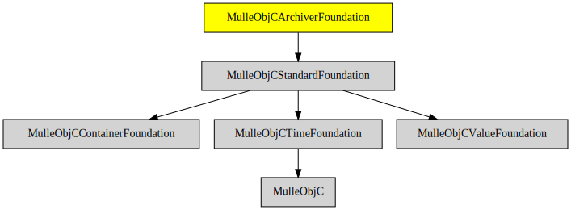

# MulleObjCArchiverFoundation

#### 🚪 NSCoding classes like NSArchiver/NSUnarchiver

These classes help with serializing objects. Typically you serialize them
into a file or into an NSData for transport over the internet.

Binary serialization has somewhat fallen out of favor recently, but can still
be useful for caches and the like.

| Release Version                                       | Release Notes
|-------------------------------------------------------|--------------
|  [](//github.com//MulleObjCArchiverFoundation/actions)| [RELEASENOTES](RELEASENOTES.md) |


## API

| Class               | Description
|---------------------|-----------------------
| `NSCoder`           |
| `NSArchiver`        |
| `NSKeyedArchiver`   |
| `NSUnarchiver`      |
| `NSKeyedUnarchiver` |


## Requirements

|   Requirement         | Release Version  | Description
|-----------------------|------------------|---------------
| [MulleObjCStandardFoundation](https://github.com/MulleFoundation/MulleObjCStandardFoundation) |  [](https://github.com///actions/workflows/mulle-sde-ci.yml) | 🚤 Objective-C classes based on the C standard library
| [mulle-objc-list](https://github.com/mulle-objc/mulle-objc-list) |  [](https://github.com///actions/workflows/mulle-sde-ci.yml) | 📒 Lists mulle-objc runtime information contained in executables.

### You are here



## Add

Use [mulle-sde](//github.com/mulle-sde) to add MulleObjCArchiverFoundation to your project:

``` sh
mulle-sde add github:MulleFoundation/MulleObjCArchiverFoundation
```

## Install

### Install with mulle-sde

Use [mulle-sde](//github.com/mulle-sde) to build and install MulleObjCArchiverFoundation and all dependencies:

``` sh
mulle-sde install --prefix /usr/local \
   https://github.com/MulleFoundation/MulleObjCArchiverFoundation/archive/latest.tar.gz
```

### Manual Installation

Install the requirements:

| Requirements                                 | Description
|----------------------------------------------|-----------------------
| [MulleObjCStandardFoundation](https://github.com/MulleFoundation/MulleObjCStandardFoundation)             | 🚤 Objective-C classes based on the C standard library
| [mulle-objc-list](https://github.com/mulle-objc/mulle-objc-list)             | 📒 Lists mulle-objc runtime information contained in executables.

Download the latest [tar](https://github.com/MulleFoundation/MulleObjCArchiverFoundation/archive/refs/tags/latest.tar.gz) or [zip](https://github.com/MulleFoundation/MulleObjCArchiverFoundation/archive/refs/tags/latest.zip) archive and unpack it.

Install **MulleObjCArchiverFoundation** into `/usr/local` with [cmake](https://cmake.org):

``` sh
cmake -B build \
      -DCMAKE_INSTALL_PREFIX=/usr/local \
      -DCMAKE_PREFIX_PATH=/usr/local \
      -DCMAKE_BUILD_TYPE=Release &&
cmake --build build --config Release &&
cmake --install build --config Release
```

## Author

[Nat!](https://mulle-kybernetik.com/weblog) for Mulle kybernetiK


